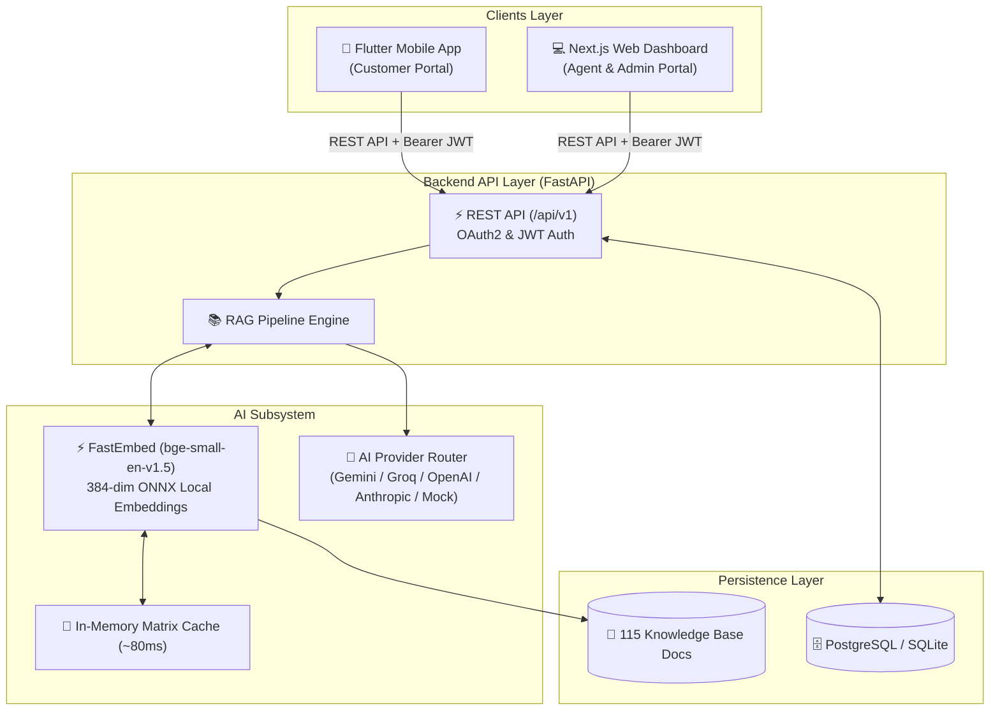
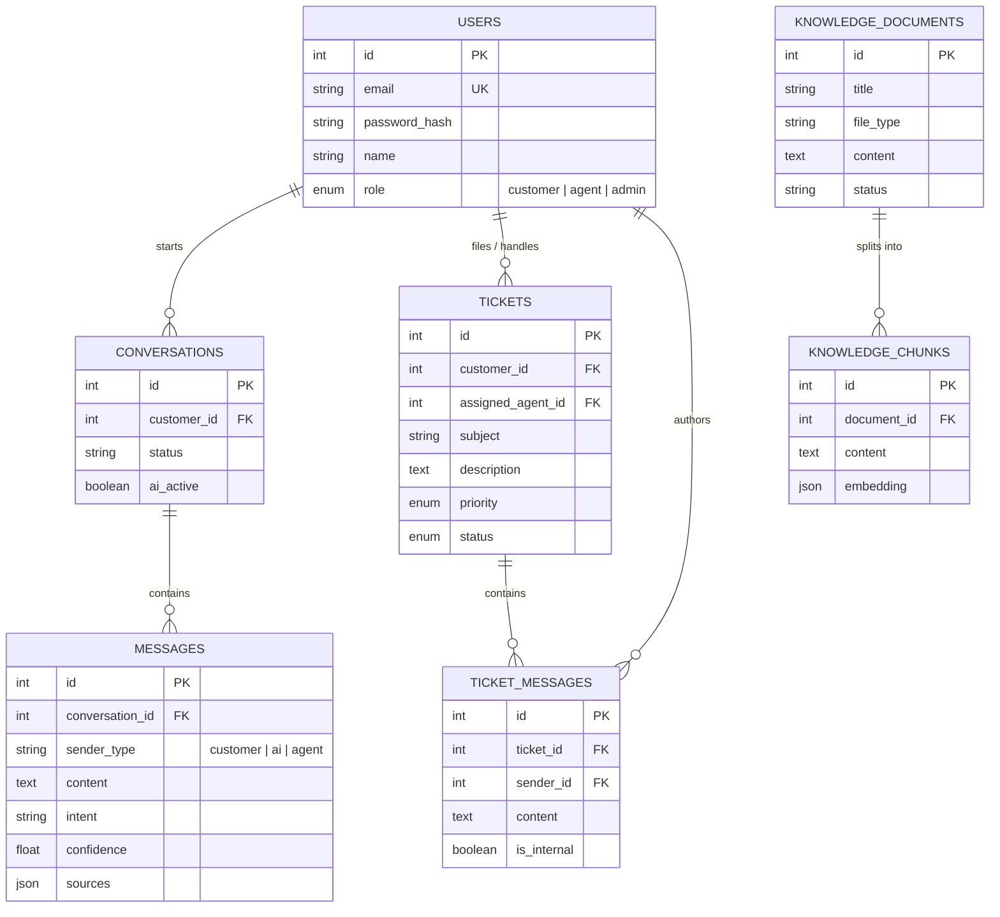

# Laurel Systems — AI-Powered Customer Support Platform

[](https://fastapi.tiangolo.com)
[](https://nextjs.org)
[](https://flutter.dev)
[](https://github.com/qdrant/fastembed)
[]()

> An enterprise full-stack customer service ecosystem combining an AI-powered conversational assistant with a centralized support agent and administrator web portal. Built with **FastAPI**, **Next.js 16**, **Flutter**, and an embedded **Retrieval-Augmented Generation (RAG)** pipeline.

---

## 1. Executive Summary & Problem Solved

Traditional support systems force customers to wait in long queues, comb through dense FAQ documents, and repeatedly explain their issues to multiple agents. Meanwhile, support teams struggle with disorganized inquiry queues and repetitive questions.

**Laurel AI Customer Support Platform** solves this:
1. **Intelligent First-Line Defense:** An AI assistant understands intent, searches verified company knowledge in milliseconds, and delivers grounded answers with source citations.
2. **Deterministic Confidence & Escalation:** Inquiries with low confidence (< 0.70) or customer complaints are automatically escalated into tickets for human support.
3. **Unified Staff Console:** Web dashboard allows agents to monitor active conversations, take over AI dialogues with one click, reply to tickets, and add internal staff notes.
4. **Knowledge Governance:** Administrators can upload PDFs, Markdown guides, or FAQs that are immediately chunked, embedded locally, and queried in real time.

---

## 2. System Architecture



---

## 3. Database Architecture (ER Summary)



Detailed database schema, indexes, and performance design: see [Database ER Documentation](docs/database_er.md).

---

## 4. Key Engineering Highlights

- **Local Vector Search (No Vector DB / No GPU):** Uses `fastembed` with `BAAI/bge-small-en-v1.5` (384-dimensional embeddings in ONNX). Runs anywhere without PyTorch or external vector database infrastructure.
- **In-Memory Embedding Matrix Cache:** Searches run against an in-memory normalized NumPy matrix keyed on a database corpus signature (`count:max_updated_at`). Cut retrieval time from **300ms down to ~80ms**.
- **Real Public Kaggle Datasets:** Seeded with 115 realistic support documents and 417 chunks derived from Kaggle (Bitext Gen AI Chatbot, Ecommerce FAQ, Synthetic IT KIs).
- **Graceful Degradation:** If external LLM API rate limits are encountered, the system seamlessly falls back to extractive knowledge-grounded answers.
- **Security & Data Isolation:** Role-based access control (RBAC). Agent internal notes (`is_internal = true`) are strictly filtered server-side to prevent leaks to customers.
- **Composite Query Optimization:** Added composite indexes matching real filter/order query patterns (`tickets(customer_id, updated_at)`, `messages(conversation_id, created_at)`).

---

## 5. Quickstart & Deployment

### Option A: One-Command Full Stack (Docker Compose)

```bash
# 1. Clone the repository and set environment variables
cp .env.example .env

# 2. Launch PostgreSQL, FastAPI backend, and Next.js Web Dashboard
docker compose up --build
```
- **Web Dashboard:** [http://localhost:3000](http://localhost:3000)
- **FastAPI API & Swagger UI:** [http://localhost:8000/docs](http://localhost:8000/docs)

---

### Option B: Local Development Setup

#### 1. Backend API (FastAPI)
```bash
cd customer_support_platform/backend
python -m venv .venv
.venv/Scripts/activate          # On Linux/macOS: source .venv/bin/activate
pip install -r requirements.txt
python -m app.seed --fresh       # Seeds initial users, tickets, and knowledge base
uvicorn app.main:app --port 8000 --reload
```

#### 2. Staff Web Dashboard (Next.js 16)
```bash
cd customer_support_platform/web-dashboard
npm install
npm run dev
```
Open [http://localhost:3000](http://localhost:3000) in your browser.

#### 3. Customer Mobile App (Flutter)
```bash
cd "customer_support_platform/Mobile app"
flutter pub get
# Run in Chrome or Android Emulator:
flutter run -d chrome --web-port=8080
```

---

## 6. Pre-Seeded Accounts & Credentials

| Role | Email | Password | Access Rights |
|---|---|---|---|
| **Administrator** | `admin@laurel.test` | `admin1234` | Full access: User management, Agent workload, KB manager, AI analytics |
| **Support Agent** | `agent@laurel.test` | `agent1234` | Ticket management, Conversation takeover, Internal notes, Customer directory |
| **Support Agent** | `nadia@laurel.test` | `agent1234` | Ticket management, Conversation takeover |
| **Customer** | `sarah@example.com` | `customer1234` | Mobile app customer: Ticket filing, AI chat |
| **Customer** | `james@example.com` | `customer1234` | Mobile app customer |

---

## 7. Acceptance Criteria Verification

All 14 acceptance criteria specified in the project requirements (`Team A.pdf`) are fulfilled:

| # | Acceptance Criterion | Implementation Details | Status |
|---|---|---|---|
| **1** | Customer registration & login | `POST /api/v1/auth/register` + `/login` with JWT and Argon2 hashing. | ✅ Verified |
| **2** | AI Assistant chat | Flutter mobile chat with real-time intent, confidence, and source citations. | ✅ Verified |
| **3** | Knowledge Base retrieval | FastEmbed vector search over 115 support documents and 417 chunks. | ✅ Verified |
| **4** | Intent identification | Intent classification across 11 support categories (`account_issue`, `refund_request`, etc.). | ✅ Verified |
| **5** | Escalation on uncertainty | Auto-escalates queries when confidence < 0.70 or on complaint intent. | ✅ Verified |
| **6** | Customer ticket creation | Customers create tickets with subject, description, category, and priority. | ✅ Verified |
| **7** | Agent ticket management | Agents assign tickets, transition status, reply, and add private internal notes. | ✅ Verified |
| **8** | Agent conversation takeover | One-click takeover in web dashboard halts AI (`ai_active: false`) for human handling. | ✅ Verified |
| **9** | Admin KB management | Admin interface supports PDF/TXT/MD uploads and FAQ creation with auto-embedding. | ✅ Verified |
| **10**| Shared backend | Mobile app and Web console communicate with the same FastAPI `/api/v1` API. | ✅ Verified |
| **11**| Auth & authorization | Strict RBAC: customers cannot access staff portal; agents cannot access admin routes. | ✅ Verified |
| **12**| Data persistence | All chats, tickets, messages, internal notes, and embeddings persist in DB. | ✅ Verified |
| **13**| System deployment | Dockerfiles for Backend & Web Dashboard + complete `docker-compose.yml`. | ✅ Verified |
| **14**| Documentation provided | Comprehensive architecture, database, API, test case, and demo documentation. | ✅ Verified |

---

## 8. Documentation Index

- [System Architecture & RAG Pipeline](docs/architecture.md)
- [Database Schema & ER Diagram](docs/database_er.md)
- [REST API Reference](docs/api.md)
- [Test Cases & Traceability Matrix](docs/test_cases.md)
- [Final Demonstration Script](docs/demo_script.md)
- [Knowledge Base & Kaggle Data Card](customer_support_platform/backend/DATA.md)
- [Web Dashboard Documentation](customer_support_platform/web-dashboard/README.md)
