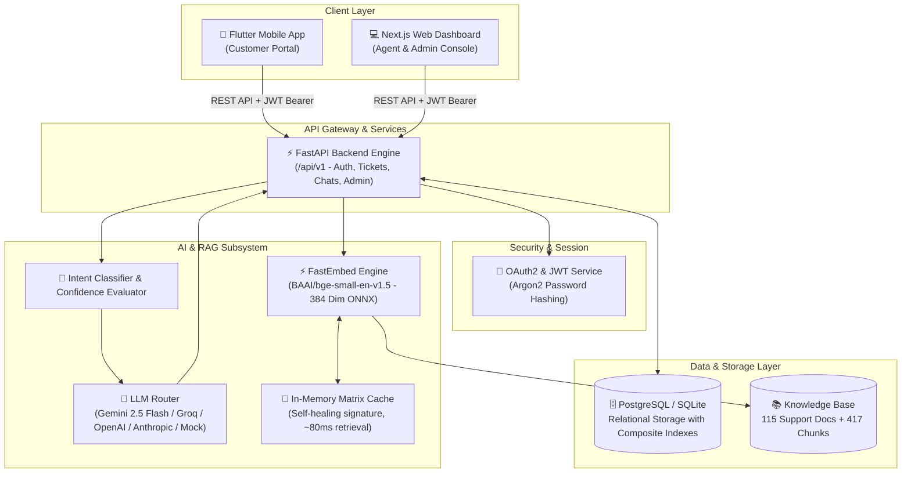
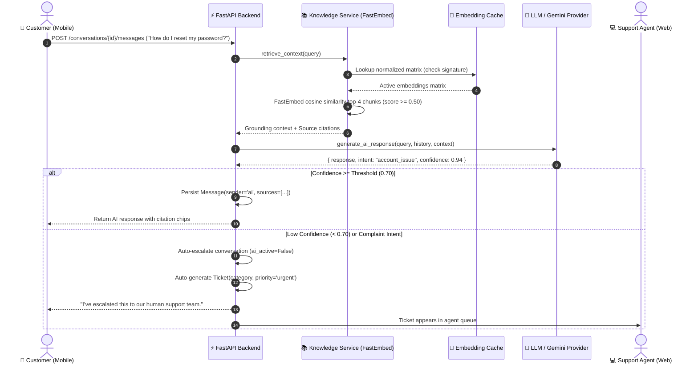
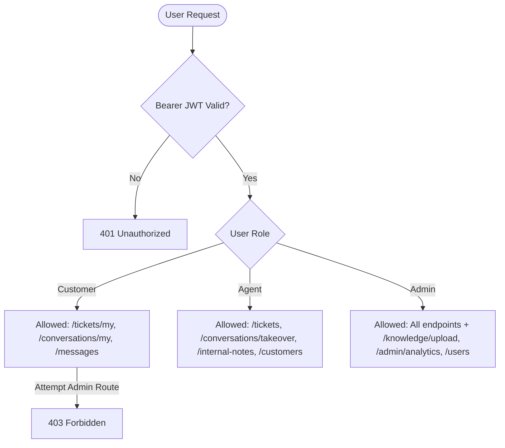

# System Architecture

## 1. High-Level Architecture

The **AI-Powered Customer Support Platform** is an enterprise-grade, multi-tier platform connecting customers, support agents, administrators, and an intelligent AI assistant grounded by Retrieval-Augmented Generation (RAG).

---

## 2. Component Breakdown

### 2.1 Customer Mobile Application (Flutter)
- **Target Audience:** End customers seeking instant answers or filing service tickets.
- **Key Modules:**
  - **Auth Feature:** Registration, login, JWT token caching with secure storage, session recovery.
  - **AI Chat Feature:** Conversational interface with real-time intent indicators, confidence badges, source citations, and human escalation trigger.
  - **Ticket Feature:** Ticket submission with priority and category selection, active ticket list, and complete interactive ticket message thread.
  - **Alerts Feature:** Dynamic notification list reflecting live ticket updates and status transitions.

### 2.2 Web Dashboard (Next.js 16 + Tailwind CSS)
- **Target Audience:** Support agents and system administrators.
- **Key Modules:**
  - **Support Dashboard:** High-level metrics, ticket status distribution, AI resolution efficiency, and recent tickets.
  - **Ticket Management:** Filterable queue (status, priority, assignee), message replying, internal agent-only notes, and assignment reassignment.
  - **Conversation Management:** Live transcripts of AI-customer interactions, intent/confidence badges, cited KB documents, and one-click agent takeover.
  - **Customer Directory:** 360-degree view of customer profiles, history, tickets, and conversations.
  - **Knowledge Base Manager:** Uploading articles (PDF, TXT, Markdown), adding structured FAQs, archiving outdated entries, and automated chunk re-indexing.
  - **Admin Analytics:** AI intent distribution breakdown, confidence trends, and escalation rates.

### 2.3 Backend API Layer (FastAPI + SQLAlchemy)
- **Framework:** FastAPI with asynchronous request handling and Pydantic v2 data validation schemas.
- **Data Persistence:** SQLAlchemy 2.0 ORM with Alembic database schema migrations.
- **Cross-Origin Resource Sharing:** Configured CORS supporting both Next.js (`:3000`) and Flutter web/desktop clients (`:8080`).
- **Data Isolation:** Enforces strict role-based access control (RBAC). Internal notes (`ticket_messages.is_internal`) are filtered server-side to ensure customers never receive private internal discussions.

---

## 3. Retrieval-Augmented Generation (RAG) Architecture

### Key RAG Optimizations
1. **Local Vector Search:** Uses `fastembed` with `BAAI/bge-small-en-v1.5` (384-dimensional vectors via ONNX runtime). No external vector database service or PyTorch GPU runtime is required.
2. **Signature-Based In-Memory Matrix Caching:**
   - Instead of decoding 417 embeddings from SQLite/Postgres on every single query (which incurred ~250ms overhead), the normalized matrix is cached in memory.
   - Cache invalidation is tracked using a zero-cost database signature (`count_active:max_updated_at`). Any document creation, edit, or archival automatically triggers a cache refresh.
   - Reduces retrieval latency from **~300ms down to ~80ms** (a ~73% performance improvement).
3. **Graceful Degradation:** If the external LLM provider encounters rate limits (e.g., Gemini free tier 10 RPM) or network timeouts, the system automatically falls back to an extractive knowledge-grounded response rather than failing or dropping customer queries.

---

## 4. Security & Role-Based Access Control (RBAC)

