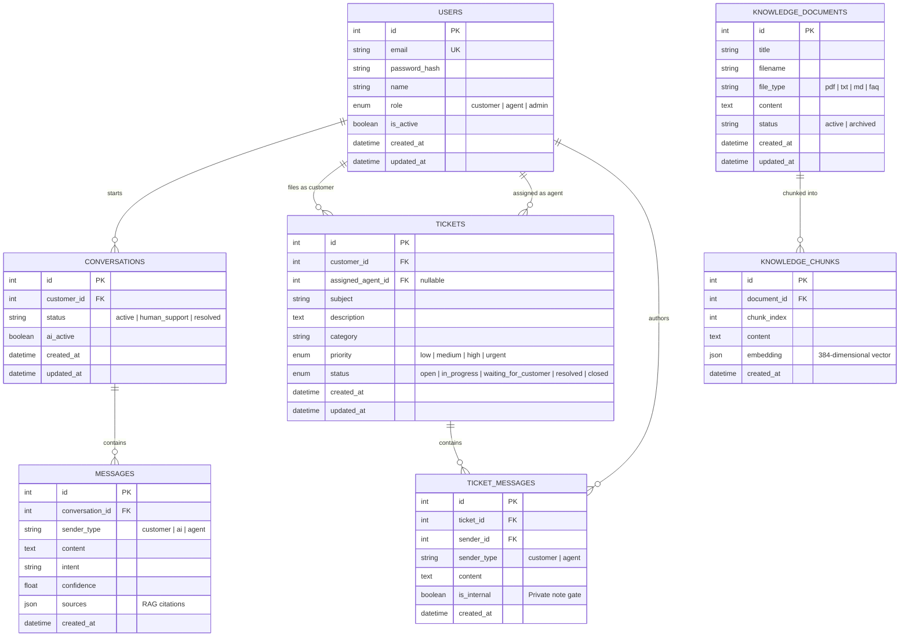

# Database Entity-Relationship (ER) Documentation

## 1. Entity-Relationship Diagram

---

## 2. Table Specifications & Indexes

### 2.1 `users`
Represents all system actors. Passwords are encrypted using Argon2.

| Column | Type | Nullable | Constraints / Index | Description |
|---|---|---|---|---|
| `id` | Integer | No | PK, `ix_users_id` | Primary Key |
| `email` | String(255) | No | Unique, `ix_users_email` | User's unique login email |
| `password_hash` | String(255) | No | - | Argon2 hashed credential |
| `name` | String(100) | No | - | Display full name |
| `role` | Enum | No | Default `customer` | `customer`, `agent`, or `admin` |
| `is_active` | Boolean | No | Default `true` | Account activation flag |
| `created_at` | DateTime | No | Default UTC now | Registration timestamp |
| `updated_at` | DateTime | No | Default UTC now | Profile update timestamp |

---

### 2.2 `conversations`
Stores chat sessions initiated by customers.

| Column | Type | Nullable | Constraints / Index | Description |
|---|---|---|---|---|
| `id` | Integer | No | PK, `ix_conversations_id` | Primary Key |
| `customer_id` | Integer | No | FK(`users.id`), `ix_conversations_customer_id` | Conversation owner |
| `status` | String(30) | No | Default `active` | Lifecycle status |
| `ai_active` | Boolean | No | Default `true` | When `false`, human agent has taken over |
| `created_at` | DateTime | No | Default UTC now | Thread initiation time |
| `updated_at` | DateTime | No | Default UTC now, `ix_conversations_updated` | Thread activity timestamp |

**Composite Performance Index:**
- `ix_conversations_customer_updated` ON `(customer_id, updated_at DESC)`: Optimizes customer chat history retrieval.

---

### 2.3 `messages`
Stores all dialog turns within an AI/human conversation.

| Column | Type | Nullable | Constraints / Index | Description |
|---|---|---|---|---|
| `id` | Integer | No | PK, `ix_messages_id` | Primary Key |
| `conversation_id`| Integer | No | FK(`conversations.id`), `ix_messages_conversation_id` | Parent conversation |
| `sender_type` | String(20) | No | - | `customer`, `ai`, or `agent` |
| `content` | Text | No | - | Utterance text |
| `intent` | String(50) | Yes | - | Detected intent (e.g., `refund_request`) |
| `confidence` | Float | Yes | - | AI confidence score (0.0 to 1.0) |
| `sources` | JSON | Yes | - | Array of cited document titles & scores |
| `created_at` | DateTime | No | Default UTC now | Message timestamp |

**Composite Performance Index:**
- `ix_messages_conversation_created` ON `(conversation_id, created_at ASC)`: Ensures instant chronological replay of conversation transcripts.

---

### 2.4 `tickets`
Central tracking unit for customer service requests.

| Column | Type | Nullable | Constraints / Index | Description |
|---|---|---|---|---|
| `id` | Integer | No | PK, `ix_tickets_id` | Primary Key |
| `customer_id` | Integer | No | FK(`users.id`), `ix_tickets_customer_id` | Filing customer |
| `assigned_agent_id`| Integer| Yes| FK(`users.id`), `ix_tickets_assigned_agent_id` | Assigned support representative |
| `subject` | String(255) | No | - | Ticket title |
| `description` | Text | No | - | Detailed issue explanation |
| `category` | String(50) | No | - | Issue category |
| `priority` | Enum | No | Default `medium` | `low`, `medium`, `high`, `urgent` |
| `status` | Enum | No | Default `open` | `open`, `in_progress`, `waiting_for_customer`, `resolved`, `closed` |
| `created_at` | DateTime | No | Default UTC now | Ticket creation timestamp |
| `updated_at` | DateTime | No | Default UTC now | Last modification timestamp |

**Composite Performance Indexes:**
- `ix_tickets_customer_updated` ON `(customer_id, updated_at DESC)`: Speeds up customer mobile dashboard ticket lists.
- `ix_tickets_status_updated` ON `(status, updated_at DESC)`: Speeds up agent web dashboard queue filtering.

---

### 2.5 `ticket_messages`
Conversation logs and staff collaboration notes on a specific ticket.

| Column | Type | Nullable | Constraints / Index | Description |
|---|---|---|---|---|
| `id` | Integer | No | PK, `ix_ticket_messages_id` | Primary Key |
| `ticket_id` | Integer | No | FK(`tickets.id`), `ix_ticket_messages_ticket_id` | Parent ticket |
| `sender_id` | Integer | No | FK(`users.id`), `ix_ticket_messages_sender_id` | Author user |
| `sender_type` | String(20) | No | - | `customer` or `agent` |
| `content` | Text | No | - | Message body |
| `is_internal` | Boolean | No | Default `false` | When `true`, hidden from customers |
| `created_at` | DateTime | No | Default UTC now | Message timestamp |

**Composite Performance Index:**
- `ix_ticket_messages_ticket_created` ON `(ticket_id, created_at ASC)`: Ensures instant chronological loading of ticket message history.

---

### 2.6 `knowledge_documents` & `knowledge_chunks`
Stores knowledge base documentation and vector embeddings for RAG retrieval.

**`knowledge_documents`**:
- `id` (PK, Integer)
- `title` (String 255)
- `filename` (String 255)
- `file_type` (String 20: `pdf`, `txt`, `md`, `faq`)
- `content` (Text)
- `status` (String 30: `active`, `archived`) - **Indexed** (`ix_knowledge_documents_status`)
- `created_at`, `updated_at` (DateTime)

**`knowledge_chunks`**:
- `id` (PK, Integer)
- `document_id` (FK `knowledge_documents.id`, `ix_knowledge_chunks_document_id`)
- `chunk_index` (Integer)
- `content` (Text)
- `embedding` (JSON nullable - 384 dimensions)
- `created_at` (DateTime)
